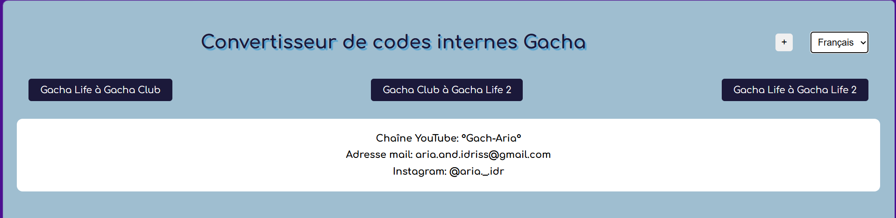
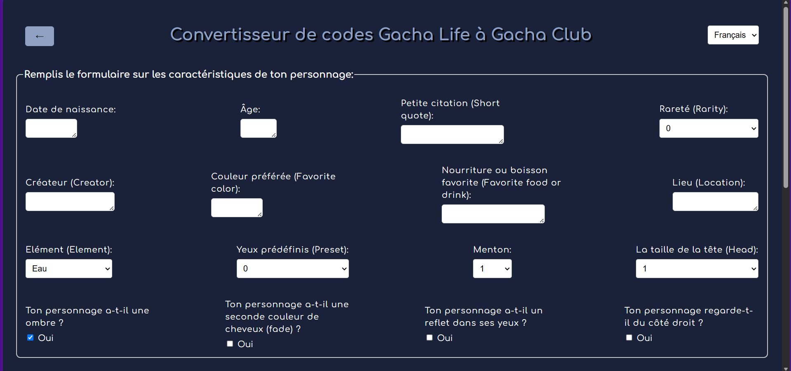
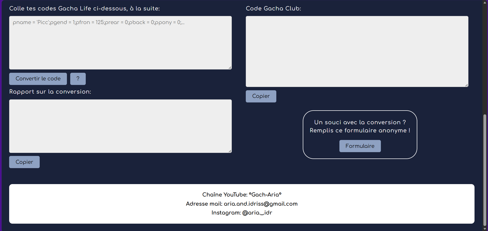
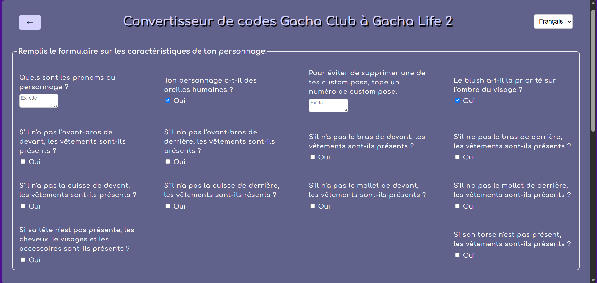
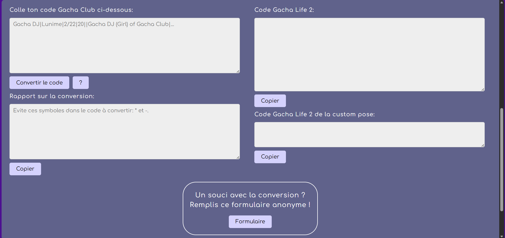
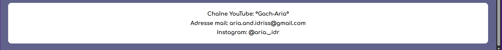
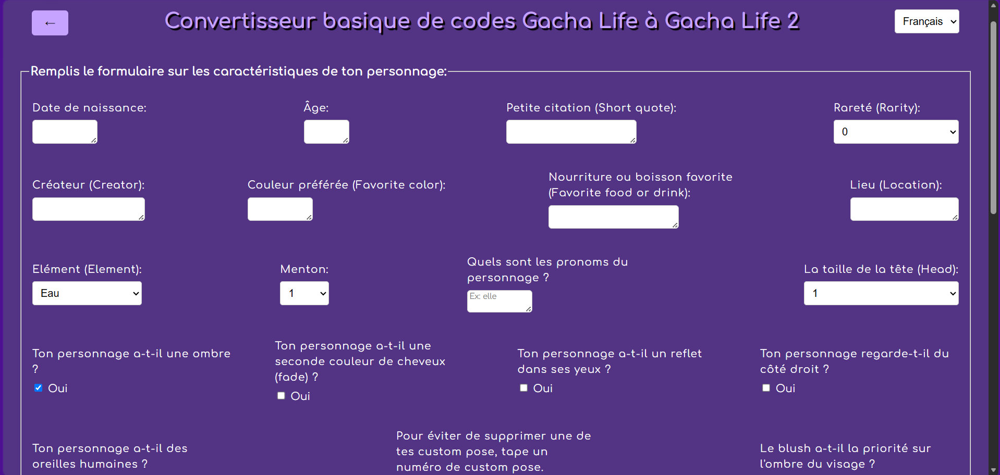
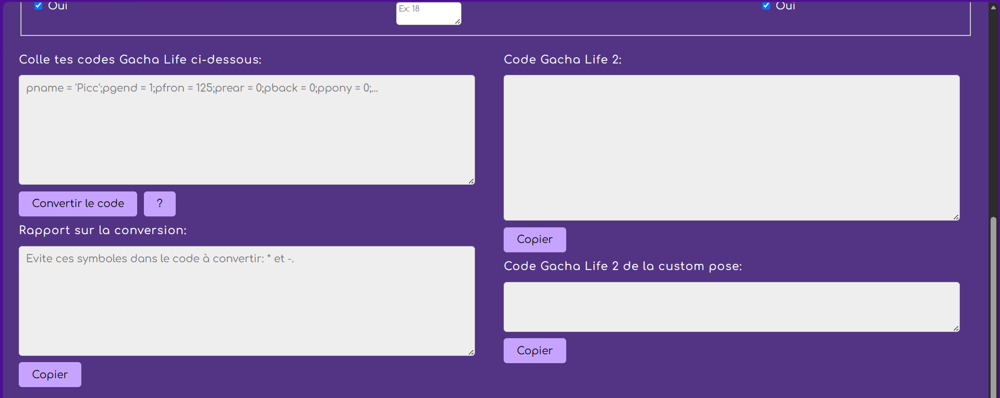

# 🌐 Convertisseur de codes internes Gacha

## Description: 
Un site web gratuit permettant de réussir l'exportation de vos personnages:
- De Gacha Life à Gacha Club (Gacha Plus)
- De Gacha Club à Gacha Life 2
- De Gacha Life à Gacha Life 2 (basique)

Le projet a commencé au mois de novembre 2025.

---
## Version:
v0.11.0-beta

---
## 📸 Aperçu
### Accueil

### Conversion de Gacha Life à Gacha Club

### Conversion de Gacha Club à Gacha Life 2

### Conversion de Gacha Life à Gacha Life 2

---

## 🚀 Fonctionnalités
- ✅ Rapport bilingue sur les erreurs pour l'utilisateur
- ✅ Formulaire bilingue en cas de problème de transcription
- ✅ Site 100% bilingue (Français et Anglais)

---
## 📌 État actuel
✅ Frontend : Fonctionnel et navigable. (Suppression de la modale pour le bouton (GL à GL2), ajout de boutons annonce pour de futures conversions)
✅ Backend : Complet. (Erreurs mineurs de conversion résolus), conversion GLGL2 non fonctionnelle
✅ Database Document : Complet pour son état actuel.
✅ Sécurité (Note: A d'après [Security Headers](SecurityHeaders.com))
❌ Fonctionnalités manquantes : transcription totale des poses.

---

## 🔜 Prochaines étapes
- Rendre fonctionnelle la conversion GLGL2
- Résoudre les potentielles erreurs de transcription et bugs possibles lors de la conversion transmises par mail.
- Faire la suite de la transcription des poses.
- Séparer les scripts des codes html.
- Ajouter la conversion de Gacha Plus vers Gacha Life 2
- Ajouter la conversion de Gacha Club vers Gacha Nebula ensuite de Gacha Life vers Gacha Nebula
- Ajouter des images décoratives pour les boutons.
- Simplifier les formulaires Google

---

## 📌 **À propos du projet**
- **Backend** : Python (Flask)
- **Frontend** : HTML, CSS, JavaScript
- **Déploiement** : Render
- **Database**: JSON, Redis

---

## 🤖 Utilisation de l'IA
Ce projet a été développé avec l'aide d'outils d'intelligence artificielle (Mistral AI).

**Ma contribution** inclut :
- L'architecture globale du projet.
- Une bonne partie du design visuel.
- La logique métier et les fonctionnalités principales.
- Les tests et la documentation.

---
## 📧 Contact
Vous pouvez me contacter par mail: aria.and.idriss@gmail.com
